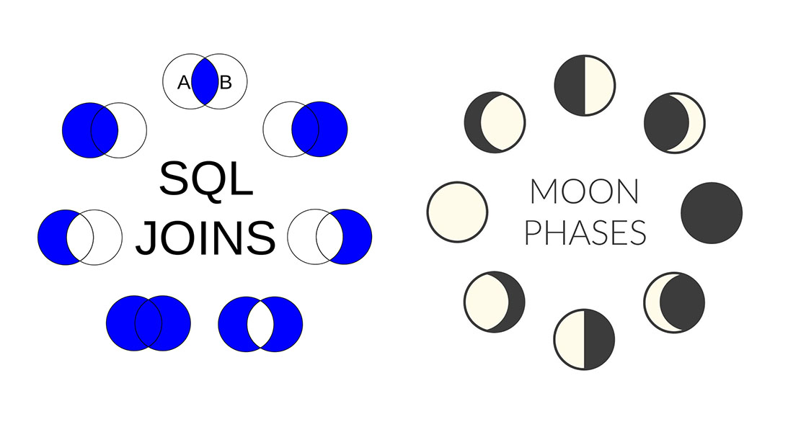

# A Rubyist's Guide to SQL Joins

If you've ever had a job that required you to run reports, you've probably had some light exposure to SQL _(Structured Markup Language)_. You've probably noticed that even if you don't have any coding experience, the syntax is pretty readable.

```sql
SELECT column FROM table WHERE (column = 'value')
```

Even if you don't know what the data is, you can draw the conclusion that we're `SELECT`ing _something_ `FROM` _something else_ `WHEN` a condition is met. You can probably even guess what that condition is! Pretty simple, right? Well, it is. Until `JOIN` enters the picture...

For years, I struggled with how to properly `JOIN` two tables. In fact, I hated them so much that my go to move was to download the data to _.csv_ and perform a bunch of `VLOOKUP` functions in Excel™

<p align="center">

I know. **I apologize.**

The reason I was scared of `JOIN`s is because whenever I looked up examples and documentation I always found something that looked like this:

```sql
SELECT * FROM employees e
  JOIN jobs j ON e.job_id = j.job_id
  LEFT JOIN employees m ON e.manager_id = m.employee_id
  INNER JOIN departments d ON d.department_id = e.department_id
  OUTER JOIN employees dm ON d.manager_id = dm.employee_id
  LEFT JOIN locations l ON d.location_id = l.location_id
  LEFT JOIN countries c ON l.country_id = c.country_id
  RIGHT JOIN regions r ON c.region_id = r.region_id
  LEFT OUTER JOIN jobs jj ON jj.job_id = jh.job_id
ORDER BY e.employee_id;
```
I'd then inevitably come across some super useful documentation like this paired with a lunar calendar of venn diagrams _(if you're thinking that's not how venn diagrams work, you're right)._

> **(INNER) JOIN:** Returns records that have matching values in both tables<br>
> **LEFT (OUTER) JOIN:** Returns all records from the left table, with matches from the right<br>
> **RIGHT (OUTER) JOIN:** Returns all records from the right table, with matches from the left<br>
> **FULL (OUTER) JOIN:** Returns all records when there is a match
> 
> **TIPS:** _**FULL OUTER JOIN**_, _**FULL JOIN**_ and _**LEFT JOIN**_ are all the same.<br>
> _**RIGHT JOIN**_ is the opposite of _**LEFT JOIN**_.




<p style="width: 70%; margin: auto;" align="center">

<br><span style="font-size: .8em;">_**Excuse me, what?** If FULL OUTER returns matches in the LEFT and RIGHT, then why use LEFT and RIGHT? And if LEFT is the same as FULL, then why have two different options? What does FULL mean anyways? I'm so confused..._ 

Each time I saw this graphic I thought to myself _"there **has** to be better explanation of this on the internet."_ But after years of searching, I've turned up nothing but variations of this lunar calendar graphic. So, I took the matter into my own hands and decided to write out each `JOIN` using a language I have a good grasp on; **Ruby**

So, withouth further ado, here are **SQL Joins as Ruby Methods**.

_**NOTE:** While the RUBY syntax below looks correct, this is pseudo code meant to represent SQL actions. I do not recommend that you copy and paste anything into your application._

### INNER JOIN
I decided to start with the one that _did_ make sense to me, the only one that _does_ work like a venn diagram (but who asked me). An `INNER JOIN` will iterate through each row in the first table, and select that row when there is a match in the second table. When selecting that row, the data from the second table is also included in the new dataset.

Here it is in **Ruby**

```rb
def INNER_JOIN(table_1, table_2)
	new_table = {} ## create a new empty table

	table_1.select do |table_1_row|
	# for each row in table_1
	
	table_2_match = table_2.find do |table_2_row| 
		# scan table_2 and find the data that matches
		table_2_row.column == table_1_row.column
	end

	if table_2_match # if a match is found (if result is true), add specified column(s) to new_table as a key/value pair
		new_table[:table_1_data] = table_1_row.column
		new_table[:table_2_data] = table_2_row_match.column
	end	
	# if no data was matched, no data from either table will be added to new_table

	return new_table
end
```
We'll refer to this as a `.select/.select` relationship. I know, we used `.find` on table_2. But, we are still in theory _selecting_ data subsets from both tables, since we end up with a subset of both original tables.

### LEFT JOIN
What a `LEFT JOIN` does is iterate through each row in the first table, and checks the second table for a corresponding value. If the second table contains a match, the data from the second table is appended to that row the first table. **All rows from the first table are always returned.**

We'll refer this as a `.map/.find` relationship. We are _mapping_ the first set of data to a new dataset. While doing so, we are iterating over the second data set to find a match to be inclued in our new data set.

```rb
def LEFT_JOIN(table_1, table_2)
	new_table = {}
				
	table_1.map do |table_1_row|
	# for each row in table_1
	
	table_2_match = table_2.find do |table_2_row| 
		# scan table_2 and find the data that matches
		table_2_row.column == table_1_row.column
	end

	if table_2_match # if a match is found (if result is true), add entire row from table_1, and the specificed column(s) from table_2 to the new_table as a key/value pair
		new_table[:table_1_data] = table_1_row # Notice, we're including the entire row of data this time
		new_table[:table_2_data] = table_2_match.column
	end	
	# if no data was matched, no data from either table will be added to new_table

	return new_table
end
```
Why is this called a _LEFT_ join? Well, in English we read from left to right. Look at the arguments for this method, which table appears on the left?

### RIGHT JOIN
We already know from that handy documentation above that a `RIGHT JOIN` is the opposite of a `LEFT JOIN`. Knowing that, we can asuume that a `RIGHT JOIN` works the same way, except it iterates thorugh table\_2 **first** (using `.map`) and then iterates through table\_1 using `.each`.

```rb
def RIGHT_JOIN(table_1, table_2)
	new_table = {}
				
	table_1.map do |table_2_row|
	# for each row in table_2
	
	table_1_match = table_1.find do |table_1_row| 
		# scan table_1 and find the data that matches
		table_1_row.column == table_2_row.column
	end

	if table_1_match # if a match is found add the entire table_2_row, and table_1_row.column to the new_table as a key/value pair
		new_table[:table_2_data] = table_2_row # Notice, we're including the entire row of data this time
		new_table[:table_1_data] = table_1_match.column
	end	
	# if no data was matched, no data from either table will be added to new_table

	return new_table
end
```
Why is this called a _RIGHT_ join. Again, we read from left to right. Look at the arguments for this method, which table appears on the right? You'll also notice that we just switched the order in wich we iterate through the tables. 

### OUTER JOIN
I actually had a really hard time writing this one in Ruby. I think that's because I couldn't think of a practical example in which I'd need an `OUTER JOIN` so it was hard for me to walk through the process logically. So, I'm going to just skip it for now. I'll figure it out when the time comes.


### CONCLUSION
Even after doing this exercise, SQL joins remain a pain in the @$$ (oh stop, that's an instance variable). But, hopefully they make a little more sense to you now. If not, there's always [**Active Record**](https://rubygems.org/gems/activerecord/). 

Actually, even if you _do_ understand SQL joins, just use **Active Record**. It'll change your life as a Rubyist.☺️

<p align="center">

